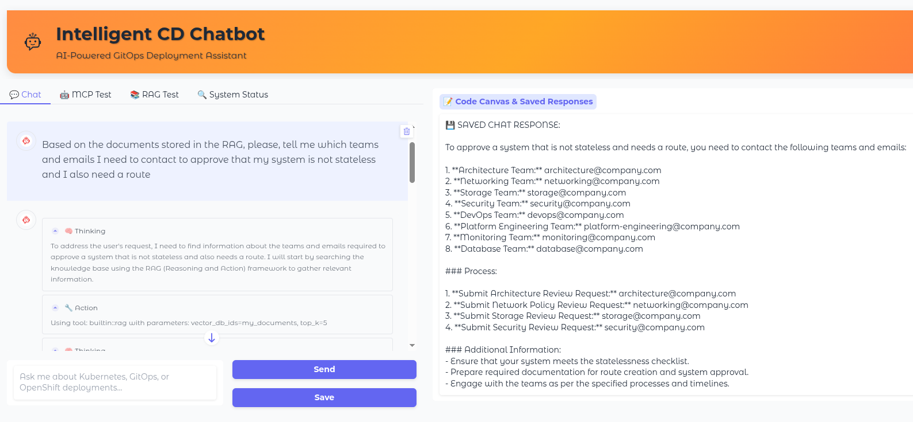
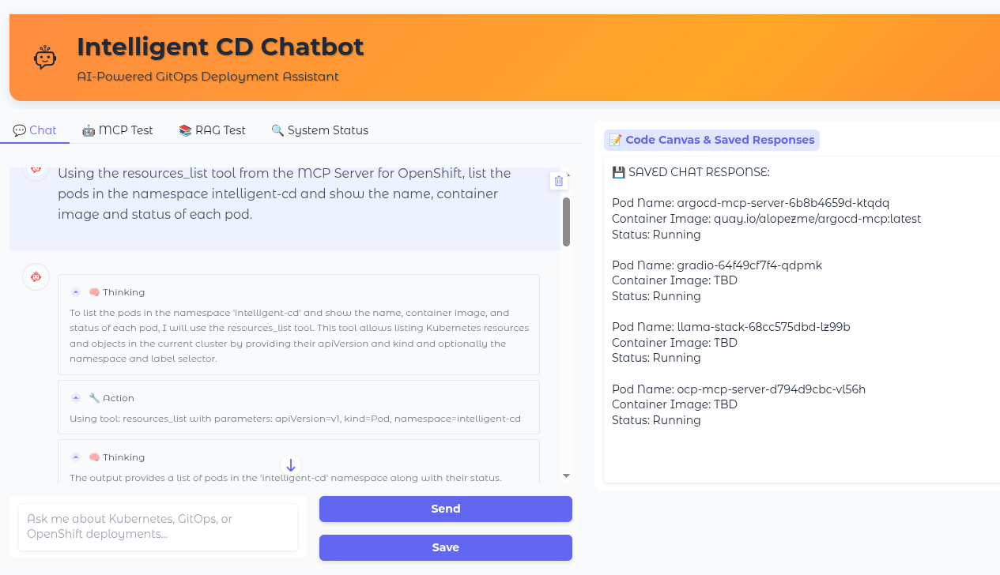
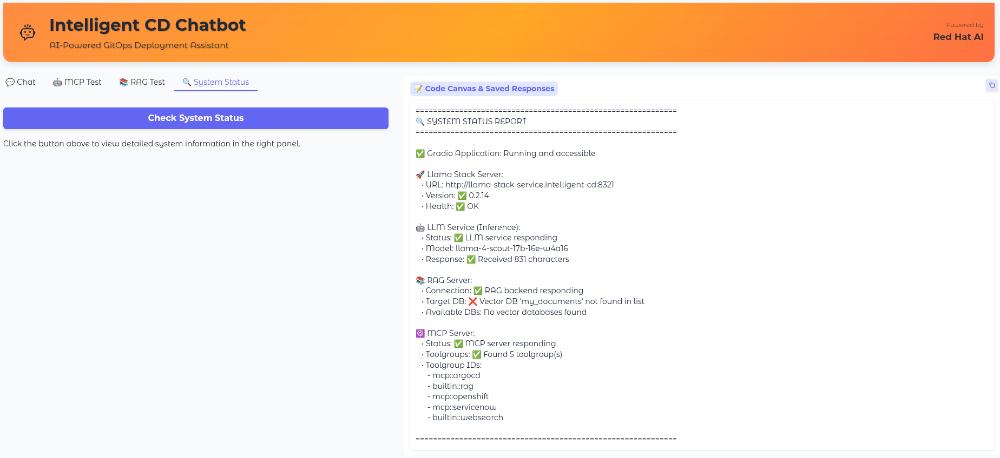
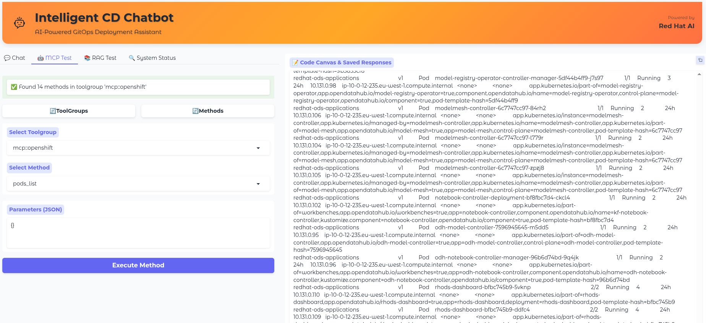
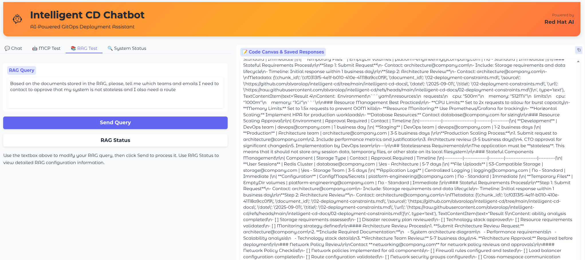

# Intelligent CD

This project provides an application that can be deployed to an OpenShift cluster to provide a chat interface to modernize and optimize your cluster using a chat interface.


## Features

- Chat interface to modernize and optimize your cluster based on **Gradio**.
- Use of **MCP servers** to provide tools to interact with OpenShift, ArgoCD, and GitHub.
- Use of **llama-stack** to coordinate all the AI components.
- Use of **Red Hat OpenShift AI** as the base platform for all the AI components.


## Architecture

The following diagram shows the architecture of the Intelligent CD application.


## Look & Feel

Your first question is probably: "OK, what how does it look like?". For that reason, I've added some screenshots of the main features of the application:

1. The most simple usage is just accessing the local Llama Stack RAG that has been loaded using the RHOAI pipeline:



2. The chat also allows at the same time, to use the result of an MCP Server call to enhance the response:



3. As this is a really complex architecture with many moving pieces, there is a section in the application that just shows a summary of the status and configuration of all the components. This is for debugging purposes:



4. Also, as the MCP Server might be available (and it is possible to list the tools), but then credentials might be wrong, I've added another Tab that allows to execute individual tools for any of the configured Llama Stack distribution. This is also for debugging purposes:




5. Finally, the RAG module might fail if, for example, your LLama Stack is restarted without persistence, etc. For that reason, there is another tab just focused on retrieving results from the vector database (MilvusDB by default).

<!--  # TO DO -->


## Repository structure

This repository is organized as follows:

1. `ìntelligent-cd-app`: This is the Gradio application that provides the chat interface.
2. `intelligent-cd-chart`: This is the Helm chart that deploys the Intelligent CD application.
3. `intelligent-cd-docs`: Fake documentation of a fake app that is supposed to be deployed on OpenShift manually.
4. `intelligent-cd-pipelines`: This folder contains a set of KubeFlow pipelines to run on OpenShift.

In order to deploy the Intelligent CD application, without customizing it, you can use the ArgoCD application `app-intelligent-cd.yaml` that is provided in this repository.


## Deploy the application

All the components can deployed using **ArgoCD**, but as there are several variables to be set, we provide a script that will set the variables and deploy the application. 

1. First, you need to create a `.env` file with the following variables:

```bash
cp .env.example .env
```

2. Adapt the values of `.env`and then run the script to deploy the application:

```bash
./auto-install.sh
```

3. If you need extra customization, you can modify the values.yaml from the `intelligent-cd-chart/values.yaml`

4. You can use the chat interface to modernize and optimize your cluster. This is exposed here:

```bash
oc get route gradio -n intelligent-cd --template='https://{{ .spec.host }}/?__theme=light'
```

> [!CAUTION]
> **Bug: Llamastack in several namespaces**
> There is a bug in the current implementation of the Llama Stack operator provided in OpenShift AI. With this bug, the `ClusterRoleBinding` to deploy the Llama Stack Distribution with extra privileges is only created automatically in the first namespace where a Llama Stack Distribution is deployed.
> If you already deployed the Llama Stack Distribution in a namespace, you can create the CRB manually in the other namespaces by running the following command:
> ```bash
> oc adm policy add-cluster-role-to-user system:openshift:scc:anyuid -z llama-stack-sa --rolebinding-name llama-stack-crb-$NAMESPACE -n $NAMESPACE
> ```


## MCP Servers configuration


Each of these MCP Servers will need a different kind of authentication to interact with their components. In this section I try to compile all the configuration that you need for this.


### 1. OpenShift MCP Server

This MCP Server is only capable of connecting to one single cluster based on the local `kubeconfig`. For that reason, we have created a Service Account with certain permissions to access the cluster.


### 3. ArgoCD MCP Server

The ArgoCD MCP Server handles the authentication based on an API Token created against the ArgoCD Server API using the `admin` user. For that reason, in the `./auto-install.sh`, I already automated the process of retrieving the token based on the admin user and password created in OpenShift as a secret.


### 3. GitHub MCP Server

For the GitHub MCP Server, you need to create a personal access token with the following permissions. The permissions might be reduced if you want a subset of the features, but this is what I provided for a simplified experienced. Make sure that you use the new **Personal Access Token** so that you only provide these permissions against a certain number of repositories. 

**Token Details:**
- Repositories: 2 (intelligent-cd, intelligent-cd-gitops)
- Total Permissions: 14

**Required Permissions:**

| Permission | Access Level |
|------------|--------------|
| Actions | Read-only |
| Variables | Read-only |
| Administration | Read-only |
| Contents | Read-only |
| Environments | Read-only |
| Issues | Read-only |
| Merge queues | Read-only |
| Metadata | Read-only |
| Pages | Read-only |
| Pull requests | Read-only |
| Webhooks | Read-only |
| Secrets | Read-only |
| Commit statuses | Read-only |
| Workflows | Read and write |


### 4. ServiceNow MCP Server

ServiceNow allows several types of authentication, but for demo purposes we will use the `basic` authentication for user/password. For the ServiceNow MCP Server, you need to create a developer instance of the ServiceNow platform:

1. Access the [Developer portal](https://developer.servicenow.com) in ServiceNow.
2. Create a new instance and access the [Management Console](https://developer.servicenow.com/dev.do#!/manage-instance).
3. Retrieve the `Instance URL`, `Username`, and `Password` from the Management Console.
4. Add those variables to the `.env` file.


## Customizing, adapting the components

### 1. Generate new version of Gradio


If you need to adapt the `Gradio` application and create a new version, you can do so with the following commands:

```bash
podman build -t quay.io/alopezme/intelligent-cd-gradio:latest intelligent-cd-app
podman push quay.io/alopezme/intelligent-cd-gradio:latest
```

Test the image locally:

```bash
podman run --network host quay.io/alopezme/intelligent-cd-gradio:latest
```


### 2. New version of the Helm Chart Configuration

As the `./auto-install.sh` is idempotent, change whatever and execute again.


### 3. New container image of the MCP Servers

To make sure that this repository stays clean, the `Dockerfile`s to generate the container images of the MCP servers is stored in the siblings [repository](https://github.com/alvarolop/mcp-playground).


### 4. New version of the pipeline

The pipeline might change if needed. The recommendation right now is just to delete all and recreate:

```bash
python intelligent-cd-pipelines/clean-pipeline.py
python intelligent-cd-pipelines/ingest-pipeline.py
```